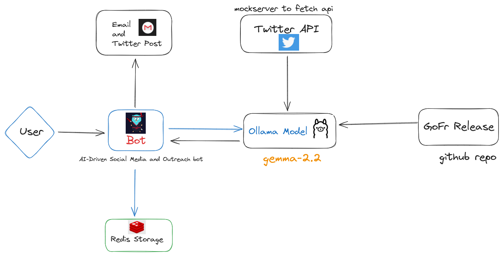

gofr-bot/
│
├── main.go               # Entry point
├── handlers/             # Handlers for routes
│   ├── social.go         # Social media-related handlers
│   ├── email.go          # Email outreach handlers
├── utils/                # Utility functions
│   ├── ai.go             # AI-related functions
│   ├── trends.go         # Trend monitoring
│   ├── metrics.go        # Analytics collection
│   └── email.go          # Email API utilities
├── config/               # Configuration files
│   └── config.go         # Environment variables
├── .env                  # API keys and secrets
└── go.mod                # Go modules
